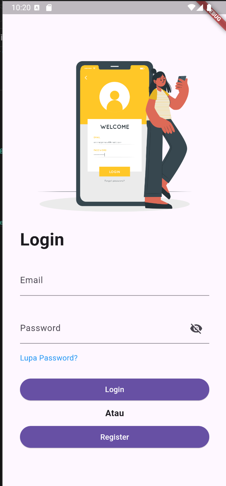
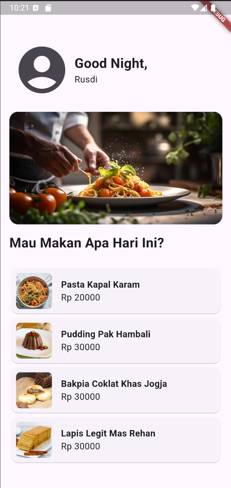

# Laporan Praktikum Flutter: Aplikasi dengan Screen Login dan Homepage
 

## 1. Pendahuluan
Pada kegiatan praktikum yang akan dilaksanakan minggu ini, tujuan utamanya adalah merancang dan mengembangkan sebuah halaman aplikasi Flutter yang meliputi halaman login serta halaman beranda (homepage). Proses ini harus dilakukan dengan mengikuti contoh atau panduan yang telah disediakan oleh asisten dosen (asdos) sebagai acuan.

## 2. Struktur Project
Proyek ini terdiri dari beberapa komponen utama sebagai berikut:

main.dart: Mengatur tema dan routing aplikasi.
homepage.dart: Menampilkan daftar makanan.
login.dart: Mengelola proses autentikasi pengguna.
## 3. Implementasi
 

### 3.1 main.dart
File ini berfungsi untuk mengatur tema dan navigasi aplikasi.

### 3.1.1 Import
Mengimpor paket Flutter serta file screen homepage.dart dan login.dart.

### 3.1.2 Tema
Menggunakan ThemeData untuk mengatur skema warna dan tema aplikasi.

### 3.1.3 Routing
Menggunakan MaterialApp untuk mengatur jalur navigasi dan menentukan rute awal.

```dart
import 'package:flutter/material.dart';  
import 'package:week_7/Screen/homepage.dart';  
import 'package:week_7/Screen/login.dart';  
  
void main() {  
  runApp(const MyApp());  
}  
  
final theme = ThemeData(  
  colorScheme: ColorScheme.fromSeed(  
      seedColor: const Color.fromARGB(255, 255, 230, 0),  
      brightness: Brightness.light),  
  scaffoldBackgroundColor: const ColorScheme.light().surface,  
  useMaterial3: true,  
);  
  
class MyApp extends StatelessWidget {  
  const MyApp({super.key});  
  
  @override  
  Widget build(BuildContext context) {  
    return MaterialApp(  
      theme: theme,  
      routes: {  
        '/login': (context) => const Login(),  
        '/homepage': (context) => const Homepage(),  
      },  
      initialRoute: '/homepage',  
    );  
  }  
}  
```

### 3.2 homepage.dart
Halaman ini menampilkan daftar makanan yang tersedia.

### 3.2.1 Data
Menyimpan informasi makanan dalam bentuk List<Map> yang terdiri dari judul, harga, dan URL gambar.

### 3.2.2 Tampilan
Menggunakan ListView.builder untuk menampilkan daftar makanan secara dinamis.

### 3.2.3 Widget
Menampilkan gambar, judul, dan harga dari setiap item makanan.

```dart
import 'package:flutter/material.dart';  
  
List<Map> data = [  
  {  
    'title': 'Pasta Kapal Karam',  
    'price': 20000,  
    'image_url': 'https://images.immediate.co.uk/production/volatile/sites/30/2013/05/Puttanesca-fd5810c.jpg?quality=90&webp=true&resize=375,341'  
  },  
  // Data lainnya...  
];  
  
class Homepage extends StatelessWidget {  
  const Homepage({super.key});  
  
  @override  
  Widget build(BuildContext context) {  
    return Scaffold(  
        body: Padding(  
      padding: const EdgeInsets.symmetric(horizontal: 16, vertical: 64),  
      child: Column(  
        crossAxisAlignment: CrossAxisAlignment.start,  
        children: [  
          Row(  
            children: [  
              IconButton(  
                icon: const Icon(Icons.account_circle, size: 100),  
                onPressed: () {},  
              ),  
              const Column(  
                crossAxisAlignment: CrossAxisAlignment.start,  
                children: [  
                  Text(  
                    'Good Night,',  
                    style: TextStyle(  
                      fontSize: 24,  
                      fontWeight: FontWeight.bold,  
                    ),  
                  ),  
                  Text('Rusdi',  
                      style: TextStyle(  
                        fontSize: 16,  
                        fontWeight: FontWeight.normal,  
                      )),  
                ],  
              ),  
            ],  
          ),  
          const SizedBox(height: 16),  
          ClipRRect(  
            borderRadius: BorderRadius.circular(16),  
            child: const Image(  
              image: AssetImage(  
                  'assets/images/side-view-cook-making-delicious-pasta.jpg'),  
              fit: BoxFit.cover,  
              width: double.infinity,  
              height: 200,  
            ),  
          ),  
          const SizedBox(height: 16),  
          const Text(  
            'Mau Makan Apa Hari Ini?',  
            style: TextStyle(  
              fontSize: 24,  
              fontWeight: FontWeight.bold,  
            ),  
          ),  
          Expanded(  
            child: ListView.builder(  
                itemBuilder: (context, index) {  
                  return Card(  
                    child: Padding(  
                      padding: const EdgeInsets.all(8.0),  
                      child: Row(  
                        children: [  
                          ClipRRect(  
                            borderRadius: BorderRadius.circular(8),  
                            child: Image.network(  
                              data[index]['image_url'],  
                              width: 64,  
                              height: 64,  
                              fit: BoxFit.cover,  
                            ),  
                          ),  
                          const SizedBox(width: 16),  
                          Column(  
                            crossAxisAlignment: CrossAxisAlignment.start,  
                            children: [  
                              Text(  
                                data[index]['title'],  
                                style: const TextStyle(  
                                  fontSize: 16,  
                                  fontWeight: FontWeight.bold,  
                                ),  
                              ),  
                              Text(  
                                'Rp ${data[index]['price']}',  
                                style: const TextStyle(  
                                  fontSize: 16,  
                                  fontWeight: FontWeight.normal,  
                                ),  
                              ),  
                            ],  
                          ),  
                        ],  
                      ),  
                    ),  
                  );  
                },  
                itemCount: data.length),  
          ),  
        ],  
      ),  
    ));  
  }  
}  
```

### 3.3 login.dart
Halaman ini mengelola proses autentikasi pengguna.

### 3.3.1 Formulir
Menggunakan Form dan TextFormField untuk input email dan password.

### 3.3.2 Validasi
Memvalidasi input pengguna dan memberikan umpan balik menggunakan SnackBar.

### 3.3.3 Navigasi
Mengarahkan pengguna ke Homepage jika login berhasil.

```dart
import 'package:flutter/material.dart';  
  
class Login extends StatefulWidget {  
  const Login({super.key});  
  
  @override  
  State<Login> createState() => _LoginState();  
}  
  
class _LoginState extends State<Login> {  
  final _formKey = GlobalKey<FormState>();  
  var _email = '';  
  var _password = '';  
  final String _auth_email = '123@123.com';  
  final String _auth_password = '123';  
  bool _passwordVisible = false;  
  
  void _submitForm() {  
    final isValid = _formKey.currentState!.validate();  
    if (!isValid) {  
      return;  
    } else {  
      _formKey.currentState!.save();  
  
      if (_email == _auth_email && _password == _auth_password) {  
        ScaffoldMessenger.of(context).clearSnackBars();  
        ScaffoldMessenger.of(context).showSnackBar(  
          const SnackBar(  
            content: Text('Login Berhasil'),  
          ),  
        );  
        Navigator.pushNamed(context, '/homepage');  
      } else {  
        ScaffoldMessenger.of(context).clearSnackBars();  
        ScaffoldMessenger.of(context).showSnackBar(const SnackBar(  
            content: Text('Login Gagal, Email atau Password Salah')));  
      }  
    }  
  }  
  
  @override  
  void initState() {  
    super.initState();  
    _passwordVisible = false;  
  }  
  
  @override  
  Widget build(BuildContext context) {  
    return Scaffold(  
      body: Center(  
        child: SingleChildScrollView(  
          child: Column(  
            mainAxisAlignment: MainAxisAlignment.center,  
            children: <Widget>[  
              Form(  
                  key: _formKey,  
                  child: Padding(  
                    padding: const EdgeInsets.symmetric(horizontal: 32.0),  
                    child: Column(  
                      crossAxisAlignment: CrossAxisAlignment.start,  
                      children: [  
                        const Image(  
                          image:  
                              AssetImage('assets/images/Mobilelogin-cuate.png'),  
                        ),  
                        const Text(  
                          'Login',  
                          style: TextStyle(  
                            fontSize: 32,  
                            fontWeight: FontWeight.bold,  
                          ),  
                        ),  
                        const SizedBox(height: 24),  
                        TextFormField(  
                          decoration: const InputDecoration(  
                            hintText: 'Enter your email',  
                            label: Text('Email'),  
                          ),  
                          onSaved: (value) {  
                            _email = value!;  
                          },  
                        ),  
                        const SizedBox(height: 32),  
                        TextFormField(  
                          obscureText: !_passwordVisible,  
                          decoration: InputDecoration(  
                            hintText: 'Enter your password',  
                            label: const Text('Password'),  
                            suffixIcon: IconButton(  
                              onPressed: () {  
                                setState(() {  
                                  _passwordVisible = !_passwordVisible;  
                                });  
                              },  
                              icon: Icon(_passwordVisible  
                                  ? Icons.visibility  
                                  : Icons.visibility_off),  
                            ),  
                          ),  
                          keyboardType: TextInputType.visiblePassword,  
                          onSaved: (value) {  
                            _password = value!;  
                          },  
                        ),  
                        const SizedBox(height: 16),  
                        GestureDetector(  
                          onTap: () {  
                            ScaffoldMessenger.of(context).showSnackBar(  
                                const SnackBar(  
                                    content: Text('Lupa Password?')));  
                          },  
                          child: const Text(  
                            'Lupa Password?',  
                            style: TextStyle(  
                              color: Colors.blue,  
                            ),  
                          ),  
                        ),  
                        const SizedBox(height: 24),  
                        SizedBox(  
                          width: double.infinity,  
                          child: ElevatedButton(  
                            onPressed: () {  
                              _submitForm();  
                            },  
                            child: Text('Login',  
                                style: TextStyle(  
                                  color: Theme.of(context).colorScheme.onPrimary,  
                                )),  
                          ),  
                        ),  
                        const SizedBox(height: 8),  
                        const Center(  
                          child: Text('Atau',  
                              style: TextStyle(  
                                fontSize: 16,  
                                fontWeight: FontWeight.bold,  
                              )),  
                        ),  
                        const SizedBox(height: 8),  
                        SizedBox(  
                          width: double.infinity,  
                          child: ElevatedButton(  
                            onPressed: () {  
                              ScaffoldMessenger.of(context).showSnackBar(  
                                  const SnackBar(content: Text('Register')));  
                            },  
                            child: Text('Register',  
                                style: TextStyle(  
                                  color: Theme.of(context).colorScheme.onPrimary,  
                                )),  
                          ),  
                        ),  
                      ],  
                    ),  
                  ))  
            ],  
          ),  
        ),  
      ),  
    );  
  }  
}  
 ```

## 4. Pengujian
Pengujian dilakukan untuk memastikan bahwa aplikasi berjalan sesuai dengan fungsionalitas yang diharapkan.

### 4.1 Login
Login Berhasil: Memasukkan email 123@123.com dan password 123 akan berhasil mengarahkan pengguna ke Homepage.
Login Gagal: Memasukkan email atau password yang salah akan menampilkan pesan kesalahan.
### 4.2 Homepage
Tampilan Daftar: Memastikan bahwa daftar makanan ditampilkan dengan benar, dengan semua elemen UI (gambar, judul, harga) terlihat.
## 5. Kesimpulan
Praktikum ini berhasil mengimplementasikan aplikasi Flutter dengan dua layar utama: Login dan Homepage. Aplikasi berjalan sesuai dengan fungsionalitas yang diharapkan, dan pengguna dapat berinteraksi dengan elemen UI yang tersedia dengan lancar.

## Gambar


