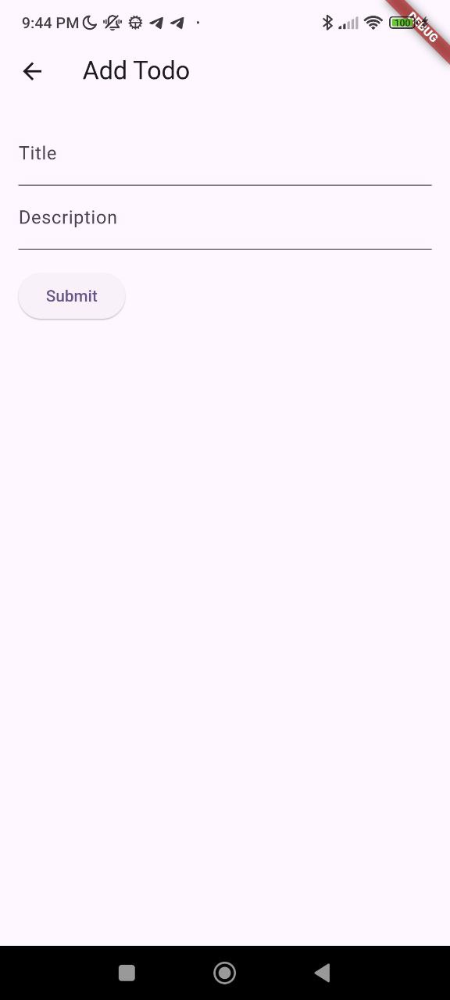

# Laporan Hasil belajar minggu ke-6

Dalam minggu ke-6 saya telah mempelajari beberapa hal:

- Slicing Figma ke Flutter
- Testing API dari Flutter menuju ke Endpoint (Endpoint menggunakan FastAPI)
- Uji coba OTP Fonnte

## Slicing Figma ke Flutter

**Desain pada Figma:**
<br>
<br>


Pada Figma saya mendesain sebuah aplikasi todo list sederhana dengan 2 halaman, halaman pertama berisi list todo dan halaman kedua berisi form untuk menambahkan todo baru.

**Hasil Slicing Figma ke Flutter:**

.jpg>)


Tampilan todo list ini dibangun menggunakan ListView.builder dan ListTile. Sedangkan untuk membuat list ini dapat dihapus dengan swipe ke kiri atau kanan, saya menggunakan Dismissible. Untuk menambahkan todo saya menggunakan Form dan TextFormField.

```dart
Form(
            key: _formKey,
            child: Column(
              crossAxisAlignment: CrossAxisAlignment.start,
              children: [
                TextFormField(
                  decoration: const InputDecoration(
                    labelText: 'Title',
                  ),
                  onSaved: (value) {
                    title = value!;
                  },
                ),
                TextFormField(
                  decoration: const InputDecoration(
                    labelText: 'Description',
                  ),
                  onSaved: (value) {
                    description = value!;
                  },
                ),
                const SizedBox(height: 16.0),
                ElevatedButton(
                  onPressed: () {
                    _submit();
                  },
                  child: const Text('Submit'),
                ),
              ],
            ),
          ),

```

## Testing API dari Flutter menuju ke Endpoint
Pada endpoint saya menggunakan FastAPI. Saya membuat endpoint untuk menambahkan todo baru dan menghapus todo. Endpoint ini saya hosting pada jaringan lokal sehingga saya dapat mengaksesnya dari aplikasi Flutter yang saya buat.

## Uji coba OTP Fonnte
Saya mencoba menggunakan Fonnte untuk mengirimkan OTP ke nomor telepon saya. Saya mengikuti langkah-langkah yang ada pada dokumentasi Fonnte dan berhasil mengirimkan OTP ke nomor telepon saya.


